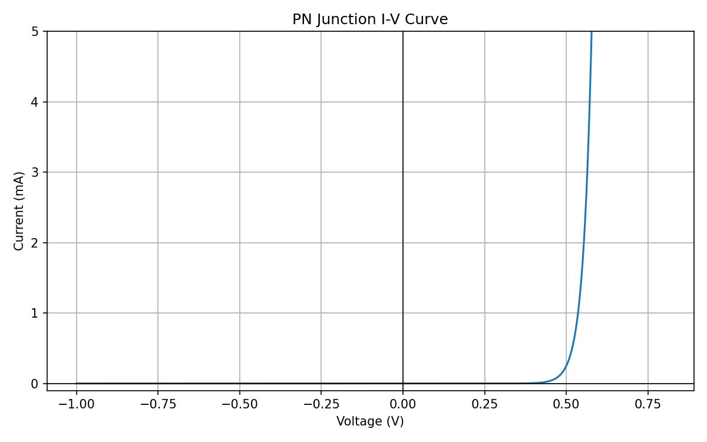
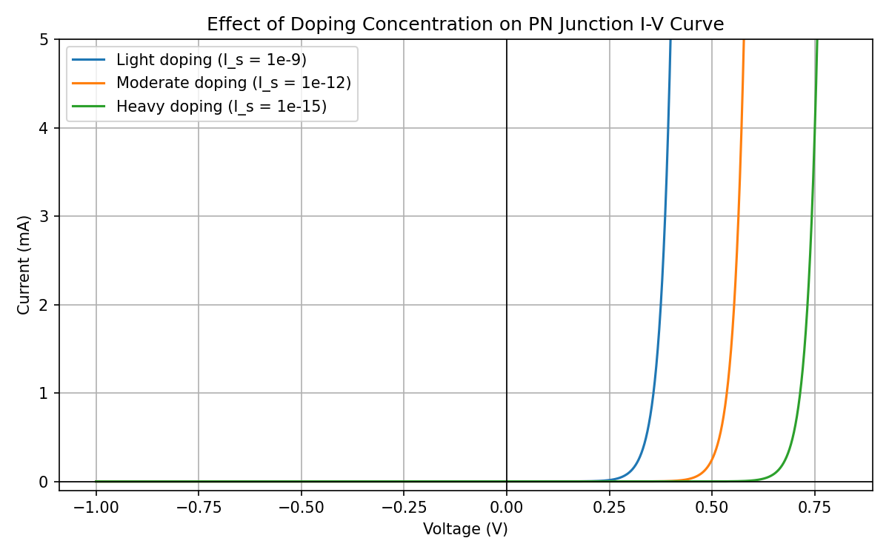
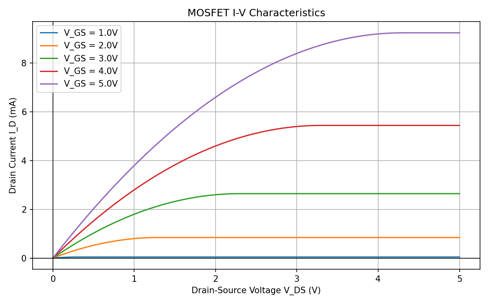

# Semiconductor Device Simulation
Python-based simulation of semiconductor device behavior, modeling and visualizing current-voltage (I-V) characteristics of PN junctions and MOSFETs.

## Overview
This project progressively builds from fundamental device physics, PN junctions and I-V curves, to more complex semiconductor behavior, including MOSFETs, connecting each simulation to real fabrication concepts relevant to semiconductor manufacturing.

## Notebooks

### 01 - PN Junction
- Models a silicon PN junction using the Shockley Diode Equation
- Plots an I-V (current vs voltage) curve showing reverse bias, forward bias threshold, and exponential rise in current
- Demonstrates silicon's characteristic 0.6V forward bias threshold

### 02 - Doping Variation
- Simulates how doping concentration affects PN junction behavior
- Plots three I-V curves with different reverse saturation currents (I_s), corresponding to different doping concentrations (weak, moderate, heavy)
- Shows how heavier doping shifts the turn-on voltage higher and steepens the exponential rise in current
- Directly relevant to ion implantation process steps in semiconductor fabrication

### 03 - MOSFET I-V Characteristics
- Models NMOS transistor behavior using drain current equations
- Plots drain current (I_D) vs drain-source voltage (V_DS) for different gate voltages 
- Clearly shows linear and saturated region behavior
- Demonstrates how gate voltage controls current

## Key Concepts Demonstrated

- PN junction physics and depletion region formation
- Shockley Diode Equation and reverse saturation current
- Effect of doping concentration on device electrical behavior
- MOSFET threshold voltage, channel formation, and pinch-off
- Connection between fabrication parameters and electrical behavior

## Technologies Used

- Python 3
- NumPy - numerical simulation
- Matplotlib - data visualization
- Jupyter Notebook - interactive development

## How to Run

1. Clone this repository 
2. Open Anaconda and launch Jupyter Notebook
3. Navigate to the project folder
4. Run each notebook in order (01 → 02 → 03)

## Results

### PN Junction I-V Curve

### Doping Variation

### MOSFET I-V Characteristics 

